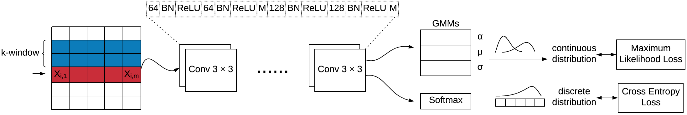

# STAN: Synthetic Network Traffic Generation using Autoregressive Neural Models

## Overview

Implementation of our submitting paper Network Traffic Data Generation usingAutoregressive Neural Models.

STAN is an autoregressive data synthesizer that can generate synthetic time-series multi-variable data.
A flexible architecture supports to generate multi-variable data with any combination of continuous & discrete attributes.

- **Dependency capturing**: STAN learns dependency in a time-window context rectangular,
  including both temporal dependency and attribute dependency.
- **Network structure**: STAN uses CNN to extract dependent context features, mixture density layers to predict continuous attributes,
  and softmax layers to predict discrete attributes.
- **Application dataset**: UGR'16: A New Dataset for the Evaluation of Cyclostationarity-Based Network IDSs [[link]](https://nesg.ugr.es/nesg-ugr16/)

<!--  -->
<center>

</center>


## STAN Structure


<center>

</center>
<!--  -->

## Usage

**Requirements** python pytorch, cuda

**Install from Git**
> git clone https://github.com/an-anonymous-repo/stan.git

**Data Format**

**STAN** expects the input data to be a table given as either a `numpy.ndarray` or a
`pandas.DataFrame` object with two types of columns:

* **Continuous Columns**: Columns that contain numerical values and which can take any value.
* **Discrete columns**: Columns that only contain a finite number of possible values, wether
these are string values or not.

Standard **Tabular (Simulated) data** with number-based sampler.
```python
def sample_trainer(X, y):
    window_height, window_width = X.size()
    stan = TableFlowSynthesizer(
                dim_in=window_width,
                dim_window=window_height,
                learning_mode='B')
    stan.fit(X, y)
 
    samples = stan.sample(10000)
    samples = pd.DataFrame(samples.numpy())
    return samples
```
**Netflow data** with continuous/discrete/categorical columns settings and condition-based sampler. (with delta time generation and target time length condition.) Discrete and categorical columns can be explicitly set to improve the modeling performance.
Instead of using `.fit()` and `.sample()`, for large dataset use `.batch_fit()` and `.time_series_sample()`. In addition, for the *Netflow* data, we need `NetworkTrafficTransformer().rev_transfer()` to support translating the generated model output back to the real *Netflow* form.

```python
def runner_train(args, train_file):
    train_from_csv = CustomDatasetFromCSV(
                        train_file,
                        5+1,
                        16)
    train_loader = torch.utils.data.DataLoader(
                        dataset=train_from_csv,
                        batch_size=512,
                        shuffle=True,
                        num_workers=16, 
                        pin_memory=True)
    stan = TableFlowSynthesizer(
                dim_in=16,
                dim_window=5, 
                discrete_columns=[[11,12], [13, 14, 15]],
                categorical_columns={5:1670, 6:1670,
                    7:256, 8:256, 9:256, 10:256},
                learning_mode='B',
                arch_mode='B'
                )
    
    stan.batch_fit(train_loader, epochs=1000)
    
    ntt = NetworkTrafficTransformer()
    samples = stan.time_series_sample(86400)
    df = pd.DataFrame(samples.cpu().numpy())
    df_rev = ntt.rev_transfer(df, user_id)
    return df_rev
```
## Example data making and model training cases

> examples/artificial_data_maker.py

> examples/ugr16_data_maker.py

## Trained model for UGR netflow data generation

> examples/saved_model

<!-- ## Frequently Used Command
> head 10 data_ugr16/pr_last_training.csv > data_ugr16/pr_last_tinytrain.csv

> wc -l data_ugr16/pr_last_training.csv

> CUDA_VISIBLE_DEVICES=0 python3 ugr16_data_maker.py

> find . -name "*.csv" | xargs -n 1 tail -n +2 > ../326_stan/stan_all.csv

> te,teDelta,byt,pkt,td,sp,dp,sa,da,pr -->