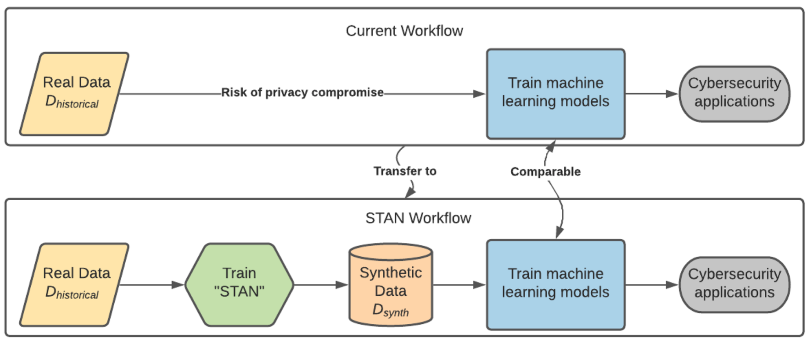

# STAN: Synthetic Network Traffic Generation using Autoregressive Neural Models

For a project overview, installation information, and detailed usage information please visit the [project homepage](https://sanghani-projects.cs.vt.edu/stan/).

* Homepage: https://sanghani-projects.cs.vt.edu/stan/
* Documentation: https://docs.google.com/document/d/1haSCXQRti21X08B9otwk4nVeB_zRoaKYFGoGXFvP3kc/edit?usp=sharing
* Repository: https://github.com/ShengzheXu/stan

## Overview

Implementation of our submitting paper Network Traffic Data Generation usingAutoregressive Neural Models.

STAN is an autoregressive data synthesizer that can generate synthetic time-series multi-variable data.
A flexible architecture supports to generate multi-variable data with any combination of continuous & discrete attributes. Tool document is [[here]](https://docs.google.com/document/d/1haSCXQRti21X08B9otwk4nVeB_zRoaKYFGoGXFvP3kc/edit?usp=sharing).

- **Dependency capturing**: STAN learns dependency in a time-window context rectangular,
  including both temporal dependency and attribute dependency.
- **Network structure**: STAN uses CNN to extract dependent context features, mixture density layers to predict continuous attributes,
  and softmax layers to predict discrete attributes.
- **Application dataset**: UGR'16: A New Dataset for the Evaluation of Cyclostationarity-Based Network IDSs [[link]](https://nesg.ugr.es/nesg-ugr16/)

<!--  -->
<center>

</center>


## STAN Structure


<center>

</center>
<!--  -->


## Installation

Download source code by 

`pip install stannetflow`

Using STAN vis Docker

Build a Docker image with STAN CLI:
```
cd ./make_nfattacker_docker
docker build -f ./nfattacker2.0 -t nfattacker:v2.0 ./
```

After build finished, run the container

```
docker run --rm -it --name nfattacker -v $(pwd):/workspace nfattacker:v2.0 bash
```

## Play with model

**Data Format**

**STAN** expects the input data to be a table given as either a `numpy.ndarray` or a
`pandas.DataFrame` object with two types of columns:

* **Continuous Columns**: Columns that contain numerical values and which can take any value.
* **Discrete columns**: Columns that only contain a finite number of possible values, whether
these are string values or not.

Standard **Tabular (Simulated) data** with number-based sampler.
```python
from stannetflow import STANSynthesizer
from stannetflow.artificial.datamaker import artificial_data_generator

def test_artificial():
  adg = artificial_data_generator(weight_list=[0.9, 0.9])
  df_naive = adg.sample(row_num=100)
  X, y = adg.agg(agg=1)

  stan = STANSynthesizer(dim_in=2, dim_window=1)
  stan.fit(X, y)
  samples = stan.sample(10)
  print(samples)
```
**Netflow data** with continuous/discrete/categorical columns settings and condition-based sampler. (with delta time generation and target time length condition.) Discrete and categorical columns can be explicitly set to improve the modeling performance.
Instead of using `.fit()` and `.sample()`, for large dataset use `.batch_fit()` and `.time_series_sample()`. In addition, for the *Netflow* data, we need `NetworkTrafficTransformer().rev_transfer()` to support translating the generated model output back to the real *Netflow* form.

```python
from stannetflow import STANSynthesizer, STANCustomDataLoader, NetflowFormatTransformer

def test_ugr16(train_file, load_checkpoint=False):
  train_loader = STANCustomDataLoader(train_file, 6, 16).get_loader()
  ugr16_n_col, ugr16_n_agg, ugr16_arch_mode = 16, 5, 'B'
  # index of the columns that are discrete (in one-hot groups), categorical (number of types)
  # or any order if wanted
  ugr16_discrete_columns = [[11,12], [13, 14, 15]]
  ugr16_categorical_columns = {5:1670, 6:1670, 7:256, 8:256, 9:256, 10:256}
  ugr16_execute_order = [0,1,13,11,5,6,7,8,9,10,3,2,4]

  stan = STANSynthesizer(dim_in=ugr16_n_col, dim_window=ugr16_n_agg, 
          discrete_columns=ugr16_discrete_columns,
          categorical_columns=ugr16_categorical_columns,
          execute_order=ugr16_execute_order,
          arch_mode=ugr16_arch_mode
          )
  
  if load_checkpoint is False:
    stan.batch_fit(train_loader, epochs=2)
  else:
    stan.load_model('ep998') # checkpoint name
    # validation
    # stan.validate_loss(test_loader, loaded_ep='ep998')

  ntt = NetflowFormatTransformer()
  samples = stan.time_series_sample(864)
  df_rev = ntt.rev_transfer(samples)
  print(df_rev)
  return df_rev
```
## Example data making and model training cases

```
python test.py
```

## Citations

```bibtex
@inproceedings{xu2021stan,
  title={STAN: Synthetic Network Traffic Generation with Generative Neural Models},
  author={Xu, Shengzhe and Marwah, Manish and Arlitt, Martin and Ramakrishnan, Naren},
  booktitle={International Workshop on Deployable Machine Learning for Security Defense},
  pages={3--29},
  year={2021},
  organization={Springer}
}
```
